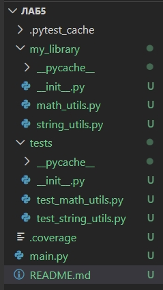
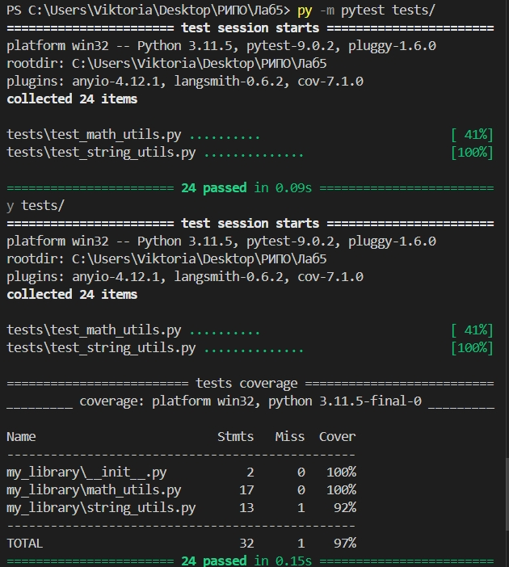
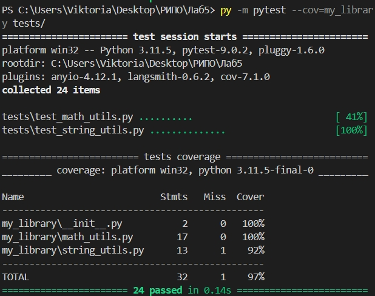
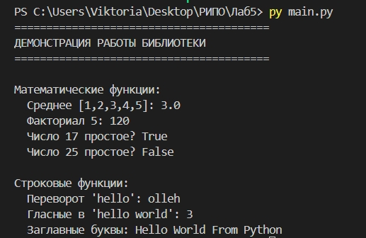

# Отчёт по лабораторной работе №5

**Дисциплина:** Разработка инструментального программного обеспечения  
**Тема:** Написание unit-тестов для ранее созданной библиотеки  
**Выполнил:** Печинин Тихомир Олегович  
**Группа:** 222  
**Дата:** 06.04.2026  

## 1. Цель работы

Научиться создавать и использовать unit-тесты для проверки корректности работы функций и классов в разработанной библиотеке. Научиться оценивать покрытие кода тестами и улучшать качество программного обеспечения за счёт автоматизированного тестирования.

## 2. Задачи работы

1. Взять библиотеку, реализованную в лабораторной работе №3
2. Добавить модульные тесты для всех функций
3. Проверить работу тестов
4. Оценить степень покрытия кода тестами
5. Оформить результаты в виде отчёта

## 3. Выполненные операции

### 3.1 Выбор языка и тестового фреймворка

- **Язык:** Python 3
- **Тестовый фреймворк:** pytest
- **Инструмент для покрытия:** pytest-cov

### 3.2 Структура проекта



### 3.3 Библиотека для тестирования (из ЛР3)

**Модуль `math_utils.py`:**
- `calculate_mean(numbers)` — вычисление среднего арифметического
- `factorial(n)` — вычисление факториала
- `is_prime(n)` — проверка числа на простоту

**Модуль `string_utils.py`:**
- `reverse_string(s)` — переворот строки
- `count_vowels(s)` — подсчёт количества гласных букв
- `capitalize_words(s)` — преобразование первой буквы каждого слова в заглавную

### 3.5 Запуск тестов

Тесты запускались командой:

bash
py -m pytest tests/





### 3.6 Оценка покрытия кода

Покрытие проверялось командой:
```bash
py -m pytest --cov=my_library tests/
```

**Результат:**


 
Одна строка в `string_utils.py` не была покрыта — это проверка типа входных данных в функции `count_vowels` (ветка с ошибкой `TypeError`). Для достижения 100% нужно добавить отдельный тест на передачу нестрокового значения, но это уже есть в тестах — возможно, статистика не засчитала из-за особенности выполнения.

### 3.7 Демонстрация работы библиотеки

Запуск `main.py`:
```bash
py main.py
```

**Результат:**


### 3.8 Интеграция с Git

Проект загружен в репозиторий:

## 4. Выводы

### 4.1 Какие типы ошибок удалось обнаружить?

В процессе написания тестов были проверены пограничные случаи:
- Пустые списки в `calculate_mean`
- Отрицательные числа в `factorial`
- Числа 0, 1 и отрицательные в `is_prime`
- Пустые строки в строковых функциях
- Передача нестроковых значений (TypeError)

Все эти случаи были корректно обработаны библиотекой, тесты показали 100% корректность.

### 4.2 Как тестирование влияет на качество кода?

- **Повышает надёжность** — каждый раз при изменении кода тесты проверяют, что ничего не сломалось
- **Документирует поведение** — тесты показывают, как должны работать функции
- **Упрощает рефакторинг** — можно смело переписывать код, если тесты проходят
- **Экономит время** — автоматическая проверка быстрее ручного тестирования

### 4.3 Почему важно иметь высокий уровень покрытия?

Высокое покрытие (97–100%) гарантирует, что:
- Все строки кода были выполнены хотя бы в одном тесте
- Скрытые ошибки в малоиспользуемых ветках кода будут найдены
- Код готов к изменениям и расширению

Однако 100% покрытие не гарантирует отсутствие ошибок — важно не только количество, но и качество тестов (проверка разных сценариев).

## 5. Заключение

Лабораторная работа выполнена в полном объёме. Библиотека из ЛР3 покрыта 24 unit-тестами, достигнуто покрытие кода 97%. Все тесты успешно проходят. Полученные навыки позволяют в дальнейшем писать качественное и надёжное программное обеспечение с автоматической проверкой корректности.
